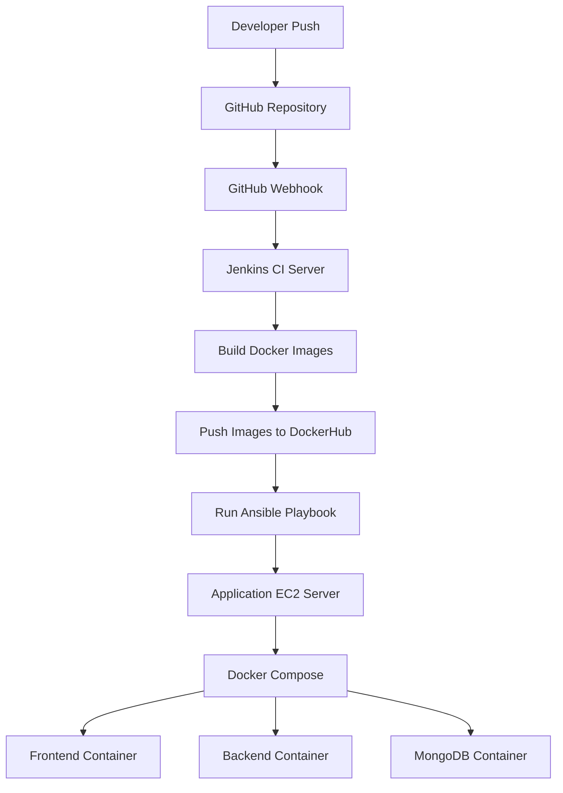
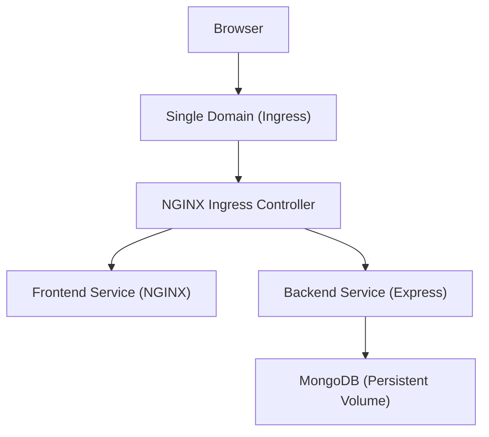

# 🚀 DevOps Portfolio – MERN Application on Kubernetes

This project demonstrates my journey of transforming a simple MERN portfolio application into a production-style DevOps deployment using Docker, Docker Compose, and Kubernetes (Minikube) with NGINX Ingress.

The focus of this project is on real-world DevOps practices, including containerization, orchestration, networking, and debugging.

---

## 🌐 Live Application

- https://kabitha-sharma.onrender.com/

---

## 🧱 Tech Stack

- Frontend: React (Vite), NGINX
- Backend: Node.js, Express
- Database: MongoDB (4.4)
- DevOps & Infrastructure: Docker, Docker Compose, Kubernetes (Minikube), NGINX Ingress
- Version Control: Git, GitHub

---

## 🧠 What I Did in This Project

- Ran and validated the application locally on a Linux system
- Debugged MongoDB installation issues and decided to containerize MongoDB
- Created Dockerfiles for frontend and backend services
- Built Docker images and pushed them to Docker Hub
- Orchestrated the application locally using Docker Compose
- Migrated the application from Docker Compose to Kubernetes (Minikube)
- Created Kubernetes manifests for frontend, backend, and MongoDB
- Configured Persistent Volumes for MongoDB data persistence
- Resolved image pull issues by publishing images to Docker Hub
- Debugged container networking and removed all `localhost` dependencies
- Solved CORS and browser networking issues by implementing NGINX Ingress
- Configured path-based routing using Ingress for frontend and backend
- Updated frontend to use relative API paths for production readiness

---

## 🧩 Architecture Overview



---
## Kubernetes Deployment Architecture



---

## 🧪 API Endpoints

| Method | Endpoint     | Description            |
|--------|--------------|------------------------|
| POST   | /send_feed   | Store user feedback    |
| GET    | /get_feed    | Retrieve feedback data |

---

## 🚀 Key Learnings

- Docker ensures consistent environments across systems
- Docker Compose helps in understanding multi-container orchestration
- Kubernetes services are internal and not directly accessible from browsers
- Frontend and backend handle environment variables differently
- Vite uses build-time environment variables
- Ingress enables single-domain access and eliminates CORS issues
- Persistent Volumes are required for stateful applications like MongoDB

---

## 🔮 Future Enhancements

- CI/CD pipeline using GitHub Actions
- HTTPS using cert-manager
- Helm charts for Kubernetes resources
- Cloud deployment using AWS EKS or Google GKE

---

##  👉if you want to run a simple react vite app on linux server make sure that at vite.>
```
import { defineConfig } from 'vite'
import react from '@vitejs/plugin-react'

// https://vite.dev/config/
export default defineConfig({
  plugins: [react()],
  server: {
  host: true,
  port: 5173
  }
})
```


---
## 👩‍💻 Author

Kavitha Kumari 
DevOps | Cloud | Kubernetes | AWS

Portfolio: https://kabitha-sharma.onrender.com/


## The code is live at:
[kabitha](https://kabitha-sharma.onrender.com/)
